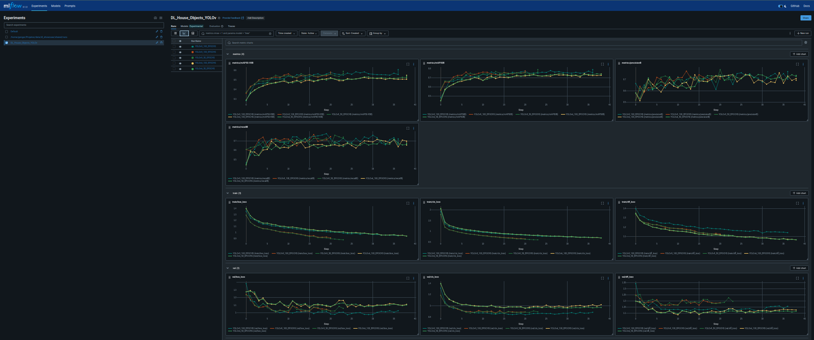
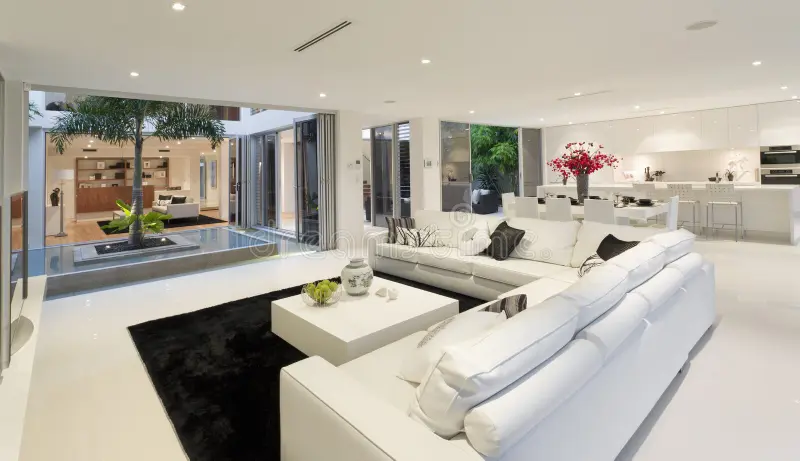
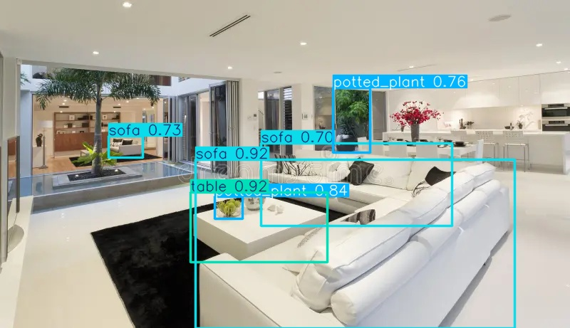

# Detecção de Objetos Domésticos

Modelo YOLOv9 para detecção em tempo real de objetos domésticos comuns (copos, garrafas, sofas, cadeiras, laptops, quadros e etc).
Utilizado MLFlow para comparação de resultados e métricas de modelos treinados.

## Estrutura do Modelo

```
dl_house_objects/
├── dl_model/
│   ├── [scripts.py]           # Alguns scripts para datacleaning
│   └── datasets/              # Conjuntos de dados
├── dl_training/
│   ├── compare_results.py     # Comparativo de resultados
│   ├── start_train_mlflow.sh  # Inicio de MLFlow Server e .py
│   └── train_compare_yolos.py # Validação de modelo
├── main.py                    # Interface principal
|── detect_object.py           # Classe de detecção de objetos
└── README.md                  # Este arquivo
```

## Datasets e Datacleaning

Foi utilizado 3 datasets de objetos domésticos:

|Dataset Name         | Link |
|----------------------|------|
| homeobjects-3K       | [Acessar Dataset](https://docs.ultralytics.com/datasets/detect/homeobjects-3k/) |
| household-objects    | [Acessar Dataset](https://universe.roboflow.com/household-detection-using-deep-learning/household-object-detection/dataset/1) |
| bottles and cups     | [Acessar Dataset](https://www.kaggle.com/datasets/dataclusterlabs/bottles-and-cups-dataset?resource=download) |

O Dataset Bottles and Cups estava no formato COCO e foi preciso converter para YOLO.
Após isso, foi feita a união de todos os arquivos (images/train e val e labels/train e val) em um único dataset unificado.
Criando também o arquivo data.yaml com as 36 classes unidas:
[data.yaml](dl_model/df_unified/data.yaml)

## Fluxo de decisões
- Treinar 4 modelos base com parametros parecidos
- Comparar resultados e métricas de cada modelo no MLFlow
- Escolher o melhor modelo base e fazer Fine Tuning
- Avaliação final e utilização

## Treino e Comparação de Modelos
Foi treinado 4 modelos com YOLOv8 e YOLOv9 com early stop (patience=10)


Resultando basicamente em:

| Modelo	            | mAP50-95	| mAP50	| Precisão	| Recall	|Tempo   |
|-----------------------|-----------|-------|-----------|-----------|--------|
|**YOLOv8 (50 epochs)**	|0.540	    |0.740  |0.738	    |0.675	    |21.7min |
|**YOLOv8 (100 epochs)**|0.548	    |0.745  |0.694	    |0.655	    |21.5min |
|**YOLOv9 (50 epochs)** |0.589	    |0.790  |0.733	    |0.742	    |35.7min |
|**YOLOv9 (100 epochs)**|0.581	    |0.776  |0.726	    |0.744	    |29.9min |

## Escolha do Modelo e Fine Tuning
Os modelos **YOLOv9** foram melhores na base. Com isso, escolhi o YOLOv9 (100 epochs) para fazer o Fine Tuning.

Foi alterado o parametro:
```
Learning Rate (lr0):1e-4 -> 3e-5
```
Adicionados:
```
Adicionado: 
augment: True,
mosaic: 0.5
mixup: 0.2
```
Garanti um learning rate mais baixo, aumentei as augmentações e mantive as 100 epochs para melhorar a robustez do modelo.

## Avaliação Final

| Métrica    | Fine Tunned | Base Model | Diferença | Vencedor       |
|------------|----------|----------|-----------|----------------|
| mAP50-95   | 0.607    | 0.581    | +0.026    | Fine Tunned ✓     |
| mAP50      | 0.791    | 0.776    | +0.015    | Fine Tunned ✓     |
| Precision  | 0.772    | 0.726    | +0.046    | Fine Tunned ✓     |
| Recall     | 0.722    | 0.744    | -0.022    | Base Model ✓     |

### Métricas de Loss (Treinamento)

| Loss        | Fine Tunned | Base Model | Diferença | Melhor         |
|-------------|----------|----------|-----------|----------------|
| Box Loss    | 0.949    | 0.915    | +0.034    | Base Model ✓     |
| Class Loss  | 0.709    | 0.645    | +0.064    | Base Model ✓     |
| DFL Loss    | 1.141    | 1.127    | +0.014    | Base Model ✓     |

### Métricas de Loss (Validação)

| Loss        | Fine Tunned | Base Model | Diferença | Melhor         |
|-------------|----------|----------|-----------|----------------|
| Box Loss    | 1.027    | 1.024    | +0.003    | Base Model ✓     |
| Class Loss  | 0.886    | 0.891    | -0.005    | Fine Tunned ✓     |
| DFL Loss    | 1.156    | 1.186    | -0.030    | Fine Tunned ✓     |

## Conclusão
O modelo **YOLOv9 Fine Tunned** superou o modelo base em métricas que o garantem mais performance no geral
Com mais dados e mais treino, o modelo pode ser ainda mais robusto para a propdução

O modelo base contudo é um ótimo modelo para prototipagem rápida

## Resultados:
Antes:

Depois:



